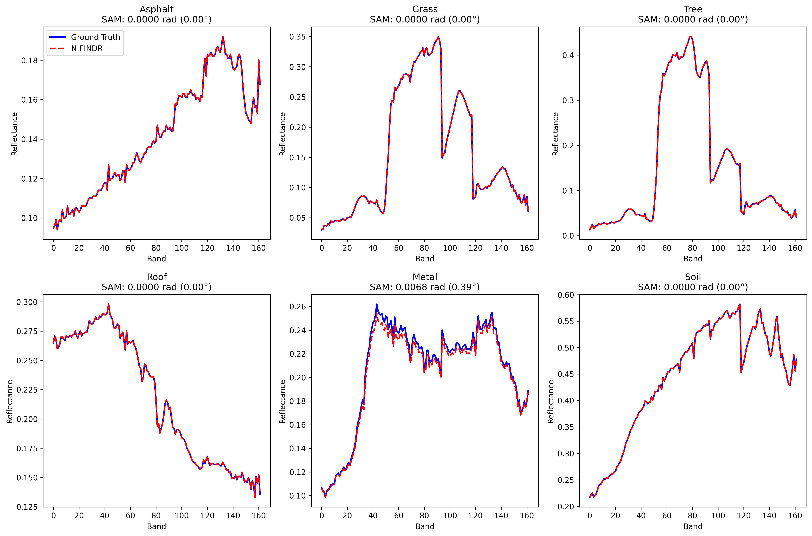

# Hyperspectral Unmixing using N-FINDR Algorithm

This repository implements the **N-FINDR algorithm** for hyperspectral unmixing using the **Urban_6 dataset**. The goal is to extract endmembers and estimate their abundances in each pixel of a hyperspectral image.

## 📌 Project Summary

Hyperspectral images contain hundreds of spectral bands, offering fine-grained material information. However, due to low spatial resolution, each pixel often contains a mixture of materials (called **mixed pixels**). Unmixing techniques aim to decompose these pixels into their constituent pure spectral signatures (**endmembers**) and the corresponding fractional contributions (**abundances**).

This project focuses on implementing the **N-FINDR algorithm**, a classical geometric approach that assumes the endmembers lie at the vertices of a simplex with maximum volume.

---

## 📂 Dataset

### 🗂 Urban_6 Dataset

- **Type**: Hyperspectral
- **Size**: 307 × 307 pixels, 162 bands
- **Source**: AVIRIS sensor (Airborne Visible/Infrared Imaging Spectrometer)
- **Usage**: Common in hyperspectral unmixing research
- **Download**: [Urban_6.mat](https://www.ehu.eus/ccwintco/index.php/Hyperspectral_Remote_Sensing_Scenes)

---

## 🚀 Implementation Details

- **Language**: Python 3
- **Libraries**:
  - `numpy`
  - `scipy`
  - `matplotlib`
  - `spectral`
  - `sklearn`

### 📈 Algorithm Steps

1. **Preprocessing**:
   - Load hyperspectral image
   - Normalize spectra (optional)

2. **Endmember Extraction (N-FINDR)**:
   - Randomly initialize `p` pixels as endmembers
   - Iteratively maximize the volume of the simplex
   - Replace endmembers to maximize volume

3. **Abundance Estimation**:
   - Use Fully Constrained Least Squares (FCLS) or other solvers

4. **Visualization**:
   - Display endmembers
   - Plot abundance maps

---

## 📸 Sample Results

| Endmembers | Abundance Maps |
|------------|----------------|
|  
|[abundances](abundance_maps.png) |


---

## 🧪 How to Run

```bash
git clone https://github.com/nichula01/hyperspectral-nfindr.git
cd hyperspectral-nfindr
pip install -r requirements.txt
python nfindr_urban6.py
